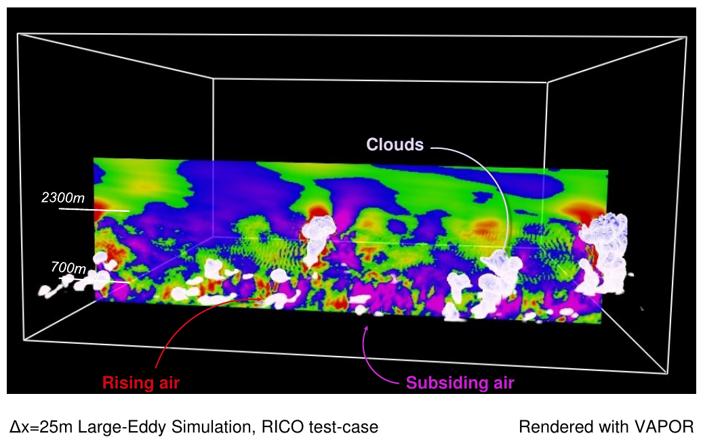

# GENESIS toolkit for analysing coherent structures in atmospheric flows

This repository contains the GENESIS toolkit developed during the
[GENESIS](http://homepages.see.leeds.ac.uk/~earlcd/GENESIS/) project, which
enables the study of coherent structures in atmospheric flows. It is designed
to for studying coherent boundary layer structures which trigger convective
clouds.




## Installation

To get started you will need to clone this repository locally

```bash
git clone https://github.com/leifdenby/genesis
cd genesis
```

All the necessary dependencies can be installed with
[conda](https://www.anaconda.com/distribution/). Once conda is installed we can
create a conda environment and install the dependencies into there:


```
conda create -n genesis -f environment.yml
conda activate genesis
```

Finally you will need to install the object identification code which is in
a separate repository

```bash
pip install git+https://github.com/leifdenby/cloud_identification@master
```

and install the code for the GENESIS toolkit itself:

```bash
pip install .
```
